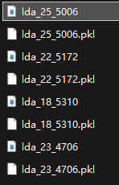

### 主题建模优化参数

- 词典过滤0.2，50
  发现一个特性：语言过滤模型在保留规范的英文标点使用时准确率很高
  于是优化了语言过滤策略

  - 语言过滤0.85

    - 
    - 
  - 优化过滤策略+语言过滤0.75
- 使用N-gram 未移除部分

  - 
- 使用N-gram 移除部分

  n-gram效果并不理想，遂弃用

  ### 6.1 继续优化建模+可视化结果分析
- py_Code\output\lda_model\lda_23_4706.pkl：只使用gensim停用词

不断添加停用词之后，得出如下模型

- 由于停用词列表已经完备，现在尝试放宽英语句子过滤条件为0.65
- 19_5687这个模型在不过滤的情况下能很好地展示聚类

### 结果可视化阶段

- 选择合适的lda模型

  - 现在觉得主题数量比可解释性更重要，不然分析会比较空洞
- 需要手动排除噪音主题
- 需要添加四个颜色的人分组分析
- 噪音主题的确定需要在pyldavis之后
- 确定并过滤噪音主题之后，进行：

  1. 维度分析：这一步理论依据还不够，要想想怎么才能让
  2. 聚类分析
